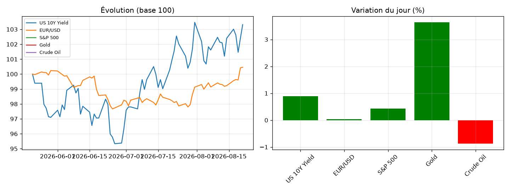

# Market Note — 2026-08-23

## 🔑 En bref
- ⚪ US 10Y Yield +0.89%
- ⚪ EUR/USD +0.04%
- ⚪ S&P 500 +0.43%
- 🟢 Gold +3.64%
- ⚪ Crude Oil -0.88%

## 📊 Graphique du jour

## 🔍 Focus : mouvement(s) notable(s)
**Gold (+3.64%)** — _[à compléter : explication]_

📈 Voir le détail complet (multi-horizons, vol, corrélations)

### Rendements multi-horizons (%)
|              |    1D |    1W |    1M |
|:-------------|------:|------:|------:|
| US 10Y Yield |  0.89 |  0.89 |  0.74 |
| EUR/USD      |  0.04 |  1.24 |  2.33 |
| S&P 500      |  0.43 | -1.43 |  3.59 |
| Gold         |  3.64 |  6.85 | 15.67 |
| Crude Oil    | -0.88 |  5.66 | -5.56 |

### Volatilité annualisée (%)
|              |   Vol annualisée |
|:-------------|-----------------:|
| US 10Y Yield |            14.65 |
| EUR/USD      |             4.73 |
| S&P 500      |            13.21 |
| Gold         |            23.59 |
| Crude Oil    |            55.89 |

### Corrélations (30 derniers jours)
|              |   US 10Y Yield |   EUR/USD |   S&P 500 |   Gold |   Crude Oil |
|:-------------|---------------:|----------:|----------:|-------:|------------:|
| US 10Y Yield |           1    |      0.41 |     -0.3  |  -0.15 |        0.56 |
| EUR/USD      |           0.41 |      1    |     -0.04 |  -0.06 |        0.04 |
| S&P 500      |          -0.3  |     -0.04 |      1    |   0.33 |       -0.64 |
| Gold         |          -0.15 |     -0.06 |      0.33 |   1    |       -0.22 |
| Crude Oil    |           0.56 |      0.04 |     -0.64 |  -0.22 |        1    |

## 🎯 Vue
_[à compléter : ta vue à 1-2 semaines]_

## ✅ Suivi de la vue précédente
_[à compléter manuellement, ou automatisé plus tard]_
