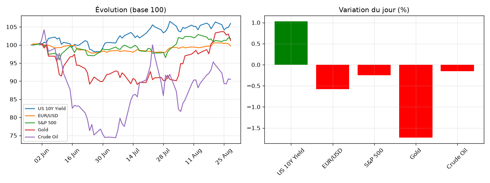

# Market Note — 2026-08-30

## 🔑 En bref
- ⚪ US 10Y Yield +1.03%
- ⚪ EUR/USD -0.58%
- ⚪ S&P 500 -0.25%
- 🔴 Gold -1.73%
- ⚪ Crude Oil -0.16%

## 📊 Graphique du jour

## 🔍 Focus : mouvement(s) notable(s)
**Gold (-1.73%)** — _[à compléter : explication]_

📈 Voir le détail complet (multi-horizons, vol, corrélations)

### Rendements multi-horizons (%)
|              |    1D |    1W |    1M |
|:-------------|------:|------:|------:|
| US 10Y Yield |  1.03 | -0.38 |  1.22 |
| EUR/USD      | -0.58 | -0.86 |  1.05 |
| S&P 500      | -0.25 |  0.49 |  3.69 |
| Gold         | -1.73 | -2.04 | 10.48 |
| Crude Oil    | -0.16 | -4.2  | -0.23 |

### Volatilité annualisée (%)
|              |   Vol annualisée |
|:-------------|-----------------:|
| US 10Y Yield |            13.98 |
| EUR/USD      |             4.56 |
| S&P 500      |            10.63 |
| Gold         |            22.14 |
| Crude Oil    |            42.3  |

### Corrélations (30 derniers jours)
|              |   US 10Y Yield |   EUR/USD |   S&P 500 |   Gold |   Crude Oil |
|:-------------|---------------:|----------:|----------:|-------:|------------:|
| US 10Y Yield |           1    |      0.37 |     -0.29 |  -0.16 |        0.66 |
| EUR/USD      |           0.37 |      1    |     -0.08 |   0.1  |        0.25 |
| S&P 500      |          -0.29 |     -0.08 |      1    |   0.28 |       -0.58 |
| Gold         |          -0.16 |      0.1  |      0.28 |   1    |       -0.06 |
| Crude Oil    |           0.66 |      0.25 |     -0.58 |  -0.06 |        1    |

## 🎯 Vue
_[à compléter : ta vue à 1-2 semaines]_

## ✅ Suivi de la vue précédente
_[à compléter manuellement, ou automatisé plus tard]_
