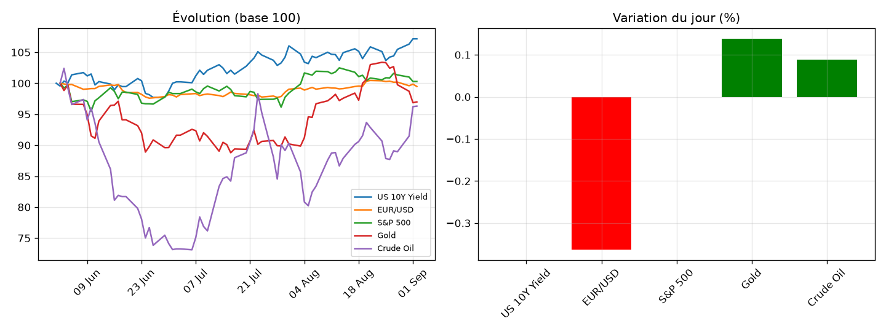

# Market Note — 2026-09-02

## 🔑 En bref
- ⚪ US 10Y Yield +0.00%
- ⚪ EUR/USD -0.36%
- ⚪ S&P 500 +0.00%
- ⚪ Gold +0.14%
- ⚪ Crude Oil +0.09%

## 📊 Graphique du jour

## 🔍 Focus : mouvement(s) notable(s)
Aucun mouvement notable aujourd'hui (seuil : ±1.5%).

📈 Voir le détail complet (multi-horizons, vol, corrélations)

### Rendements multi-horizons (%)
|              |    1D |    1W |    1M |
|:-------------|------:|------:|------:|
| US 10Y Yield |  0    |  2.83 |  3.65 |
| EUR/USD      | -0.36 | -0.85 |  0.59 |
| S&P 500      |  0    | -0.58 | -1.36 |
| Gold         |  0.14 | -5.31 |  6.31 |
| Crude Oil    |  0.09 |  9.81 | 19.18 |

### Volatilité annualisée (%)
|              |   Vol annualisée |
|:-------------|-----------------:|
| US 10Y Yield |            12.67 |
| EUR/USD      |             4.59 |
| S&P 500      |             7.36 |
| Gold         |            22.14 |
| Crude Oil    |            35.17 |

### Corrélations (30 derniers jours)
|              |   US 10Y Yield |   EUR/USD |   S&P 500 |   Gold |   Crude Oil |
|:-------------|---------------:|----------:|----------:|-------:|------------:|
| US 10Y Yield |           1    |      0.46 |     -0.34 |  -0.27 |        0.68 |
| EUR/USD      |           0.46 |      1    |     -0.09 |   0.06 |        0.23 |
| S&P 500      |          -0.34 |     -0.09 |      1    |   0.32 |       -0.64 |
| Gold         |          -0.27 |      0.06 |      0.32 |   1    |       -0.19 |
| Crude Oil    |           0.68 |      0.23 |     -0.64 |  -0.19 |        1    |

## 🎯 Vue
_[à compléter : ta vue à 1-2 semaines]_

## ✅ Suivi de la vue précédente
_[à compléter manuellement, ou automatisé plus tard]_
