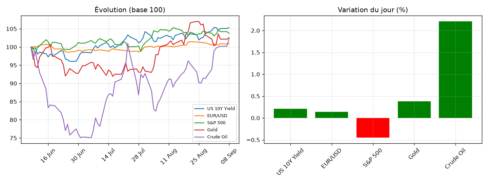

# Market Note — 2026-09-08

## 🔑 En bref
- ⚪ US 10Y Yield +0.21%
- ⚪ EUR/USD +0.14%
- ⚪ S&P 500 -0.45%
- ⚪ Gold +0.38%
- 🟢 Crude Oil +2.21%

## 📊 Graphique du jour

## 🔍 Focus : mouvement(s) notable(s)
**Crude Oil (+2.21%)** — _[à compléter : explication]_

📈 Voir le détail complet (multi-horizons, vol, corrélations)

### Rendements multi-horizons (%)
|              |    1D |    1W |    1M |
|:-------------|------:|------:|------:|
| US 10Y Yield |  0.21 | -0.04 |  2.02 |
| EUR/USD      |  0.14 |  0.11 |  0.64 |
| S&P 500      | -0.45 |  0.69 | -0.89 |
| Gold         |  0.38 |  2.27 |  1.95 |
| Crude Oil    |  2.21 |  3.64 | 13.84 |

### Volatilité annualisée (%)
|              |   Vol annualisée |
|:-------------|-----------------:|
| US 10Y Yield |            12.17 |
| EUR/USD      |             4.38 |
| S&P 500      |             8.38 |
| Gold         |            23.53 |
| Crude Oil    |            31.18 |

### Corrélations (30 derniers jours)
|              |   US 10Y Yield |   EUR/USD |   S&P 500 |   Gold |   Crude Oil |
|:-------------|---------------:|----------:|----------:|-------:|------------:|
| US 10Y Yield |           1    |      0.48 |     -0.35 |  -0.32 |        0.61 |
| EUR/USD      |           0.48 |      1    |     -0.16 |  -0.03 |        0.21 |
| S&P 500      |          -0.35 |     -0.16 |      1    |   0.32 |       -0.69 |
| Gold         |          -0.32 |     -0.03 |      0.32 |   1    |       -0.15 |
| Crude Oil    |           0.61 |      0.21 |     -0.69 |  -0.15 |        1    |

## 🎯 Vue
_[à compléter : ta vue à 1-2 semaines]_

## ✅ Suivi de la vue précédente
_[à compléter manuellement, ou automatisé plus tard]_
