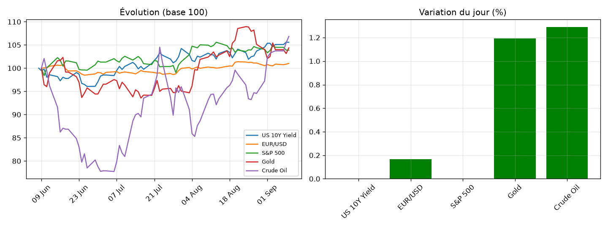

# Market Note — 2026-09-09

## 🔑 En bref
- ⚪ US 10Y Yield +0.00%
- ⚪ EUR/USD +0.17%
- ⚪ S&P 500 +0.00%
- ⚪ Gold +1.19%
- ⚪ Crude Oil +1.29%

## 📊 Graphique du jour

## 🔍 Focus : mouvement(s) notable(s)
Aucun mouvement notable aujourd'hui (seuil : ±1.5%).

📈 Voir le détail complet (multi-horizons, vol, corrélations)

### Rendements multi-horizons (%)
|              |   1D |   1W |    1M |
|:-------------|-----:|-----:|------:|
| US 10Y Yield | 0    | 0.21 |  2.6  |
| EUR/USD      | 0.17 | 0.44 |  0.87 |
| S&P 500      | 0    | 0.09 | -0.71 |
| Gold         | 1.19 | 1.83 |  1.44 |
| Crude Oil    | 1.29 | 3.54 | 13.26 |

### Volatilité annualisée (%)
|              |   Vol annualisée |
|:-------------|-----------------:|
| US 10Y Yield |            12.22 |
| EUR/USD      |             4.39 |
| S&P 500      |             8.41 |
| Gold         |            23.99 |
| Crude Oil    |            30.93 |

### Corrélations (30 derniers jours)
|              |   US 10Y Yield |   EUR/USD |   S&P 500 |   Gold |   Crude Oil |
|:-------------|---------------:|----------:|----------:|-------:|------------:|
| US 10Y Yield |           1    |      0.47 |     -0.37 |  -0.32 |        0.65 |
| EUR/USD      |           0.47 |      1    |     -0.15 |  -0.02 |        0.22 |
| S&P 500      |          -0.37 |     -0.15 |      1    |   0.35 |       -0.62 |
| Gold         |          -0.32 |     -0.02 |      0.35 |   1    |       -0.14 |
| Crude Oil    |           0.65 |      0.22 |     -0.62 |  -0.14 |        1    |

## 🎯 Vue
_[à compléter : ta vue à 1-2 semaines]_

## ✅ Suivi de la vue précédente
_[à compléter manuellement, ou automatisé plus tard]_
